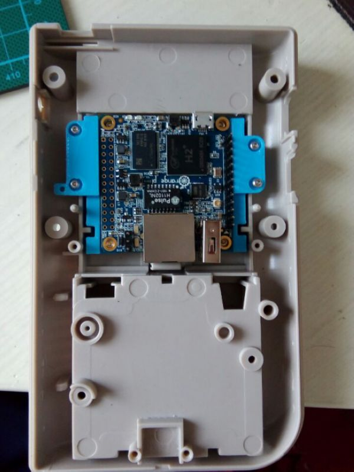

#Make your own Game Boy
##前言
算是记录一下自己diy的折腾经历，大概3月初入坑到现在，一路折腾让我学到了很多东西，同时也认识了很多一起喜欢折腾的网友，感谢大家的一路相伴与帮助~

之前听说树莓派的各种已经心水不义了，网上一查无奈国内的价格不是一般的高，这和官方宣传的差距太大了，让我犹豫许久，后来听说这是由于有很多原因导致的，我就不巴拉巴拉了，无意中就发现了国产的orangepi，选择了了体型最小的zero，然后就不知不觉进了一个很大坑。。。
##最初的尝试
最初的想法因为想diy掌机，电路板的选择就倾向于小型化了，一开始我以为很简单，兼容树莓，现成的软件可谓很丰富，结果错了，H2+的zero几乎没多少人玩，既然已经买了硬件了，那只能先研究起来，开始折腾GPIO，想想把屏幕驱动上外加按键差不多功能就搞定了，可惜找了很长时间资料真是太少了，通过一些零星的资料文件，GPIO驱动及PY库总算找到可用的了，但是很多树莓上的按键程序测试无法使用，软件不是强项只能放弃了，另外群友也移植了树莓的FBCP程序，由于底层优化等等问题还未完善，工作起来也只能复制一下屏幕的显示了，在此感谢友友的研究。

* [OrangePi Zero GPIO驱动](https://github.com/wdmomoxx/WiringOP-Zero)
* [OrangePi Zero PY库](https://github.com/wdmomoxx/orangepi_ZERO_gpio_pyH2)
* [FBTFT驱动](https://github.com/notro/fbtft)
* [OrangePi FBCP程序](https://github.com/wdmomoxx/OrangePi_FBCP)

顺便上一张工作图片，GPIO控制LED以及驱动屏幕


 

软件折腾不动那就开始折腾硬件了，屏幕重新选择了通用的AV屏幕，按键研究了一下单片机，用单片机做了一个usb的按键手柄。

 

单片机是arduino的莱昂纳多，按键板正好手上有个雕刻机简单雕刻了一块，程序简单写了一个然后兴致勃勃开始搭硬件测试，最初的想法还是用的3D打印外壳，开始按着硬件画图打印，组装，完成，结果太丑了，打印手感也不是很好，发几个图纪念一下吧。
单片机程序如下：

```
#include "Keyboard.h"
int val2, val3, val4, val5, val6, val7, val8, val9, val10, val11, val12, val13;
void setup() {
  for (int i = 2; i < 14; i++)
  {
    pinMode(i, INPUT_PULLUP);
  }
  Keyboard.begin();
}

void loop() {
  val2 = digitalRead(2);
  val3 = digitalRead(3);
  val4 = digitalRead(4);
  val5 = digitalRead(5);
  val6 = digitalRead(6);
  val7 = digitalRead(7);
  val8 = digitalRead(8);
  val9 = digitalRead(9);
  val10 = analogRead(0);
  val11 = analogRead(1);
  val12 = analogRead(2);
  val13 = analogRead(3);

  if (val2 == 0)
  {
    Keyboard.press(KEY_UP_ARROW);
    Keyboard.release(KEY_UP_ARROW);
    delay(10);
  }
  if (val3 == 0)
  {
    Keyboard.press(KEY_DOWN_ARROW);
    Keyboard.release(KEY_DOWN_ARROW);
    delay(10);
  }
  if (val4 == 0)
  {
    Keyboard.press(KEY_LEFT_ARROW);
    Keyboard.release(KEY_LEFT_ARROW);
    delay(10);
  }
  if (val5 == 0)
  {
    Keyboard.press(KEY_RIGHT_ARROW);
    Keyboard.release(KEY_RIGHT_ARROW);
    delay(10);
  }
  if (val6 == 0)
  {
    Keyboard.press(0x61);
    Keyboard.release(0x61);
    delay(10);
  }
  if (val7 == 0)
  {
    Keyboard.press(0x62);
    Keyboard.release(0x62);
    delay(10);
  }
  if (val8 == 0)
  {
    Keyboard.press(0x78);
    Keyboard.release(0x78);
    delay(10);
  }
  if (val9 == 0)
  {
    Keyboard.press(0x79);
    Keyboard.release(0x79);
    delay(10);
  }
  if (val10 == 0)
  {
    Keyboard.press(0x6C);
    Keyboard.release(0x6C);
    delay(10);
  }
  if (val11 == 0)
  {
    Keyboard.press(0x72);
    Keyboard.release(0x72);
    delay(10);
  }
  if (val12 == 0)
  {
    Keyboard.press(0xB1);
    Keyboard.release(0xB1);
    delay(10);
  }
  if (val13 == 0)
  {
    Keyboard.press(0x0A);
    Keyboard.release(0x0A);
    delay(10);
  }
}
```
 


 

##做一台属于自己的GB

网上简单搜了一下，淘宝找了个经典的GB砖头机外壳，还是拿着实物比划来的直观。看了下内部结构，香橙的zero放到里面感觉刚刚好，于是开始图画先把主板给固定上。

 



主板固定完成后还是有很大空间来利用的，众所周知，全志的芯片运行起来热乎乎的，壳子一安装，热量都散不出去，必须加个风扇才放心，找了个笔记本的风扇安上位置刚刚好。


主板和风扇搞定后开始折腾屏幕了，网上买了3.5的AV屏幕模组，一比划，这次外壳肯定得动刀了，手工用刀切了几下，效率实在是太低了，突然想起之前网上看到用纸切割塑料的视频，灵机一动抽屉里还有一个吃灰的小电磨呢，于是切了一个圆形的纸刀安上试试，


效果很不错，不像锯片会把塑料给化掉，切口也很整齐，唯一的不足，切割的时候手抖切割线也不会很直，这个后面再做弥补。

切完以后比较遗憾的是把螺丝固定的几个脚全部阵亡了，后续还得想办法如何固定后盖，屏幕就直接用胶水先固定起来了。
通电测试基本ok然后就开始想办法搞按键了，由于竖版机器，LR键比较难搞，思来想去还是整到了前面板加上ABXY正好打6个孔

按键板子比较麻烦，考虑到后面还有接入电池充电以及声音功放，干脆就做个全功能的一体板子，也省去了后面各种模块接线的繁琐

然后开始画图纸，安照GB内部的孔位及外形画了一块板子，先用木板切割了一块试装尺寸OK


开始画电路板，电路板的功能很简单，简单总结为一下几个：

*  电池接入可充电及5V输出，这样供电系统就有了；
*  功放功能，主板LR音频接入，喇叭输出以及耳机输出音量可调；
*  最重要的就是手柄按键功能，还是用单片机实现比较容易，标准的USBHID免驱设备，win，mac，linux，android等多种平台通用。
  按键板初具外形，打板前向群友要了一张比较帅的图片贴上，发给厂家开始打板。

 

在等待的过程中继续折腾外壳，按键的孔还没有开，因为是个正圆，没有打孔器开起来就比较麻烦了，最后还是尝试用雕刻机雕刻，之前没用雕刻机主要是因为以前雕刻塑料会出现粘刀的情况，这次给雕刻机换上了尖刀试试，结果效果很不错，效率大大提高，位置也比较精准，于是屏幕开窗也雕刻机开搞，就是定位比较麻烦，效果很是理想。


这里又有一个问题，比较注重外观屏幕开窗外部留一圈这样比较美观，案件位置6个孔之间的距离比较匀称，所以屏幕安装后，最上面的按键与屏幕有一小部分冲突，于是将按键一边切去一部分，为了防止与屏幕卡住，圆形的按键也会有所移动，用打印机打了一个圆形的定位环将按键定位解决了这个尴尬的问题。


几天等待按键板到手了，焊接原件刷完程序基本主要功能OK，安装上去刚刚好

 


 
遗憾的是，部分接线搞错了，导致耳机口有点问题，摇杆的按键也出现错误，等后面有空再优化吧，打板的时候顺便也打了一些手柄键盘的小板子测试，发现这个mjoy的手柄程序真的很牛逼，精度也很高，支持8个轴和28个按键，键盘的小板直接就是72个按键，以后做diy都随便接了


原外壳上有几个孔，右边2个正好把主板上的usb以及音量旋钮安装上去，测量一下，雕了一块小板子放上去刚刚好

 


 
左侧也有一个小孔，原来打算把另一个usb口也接出来，但安装后会于AV屏幕的驱动板有冲突，于是改换成充电口，因为不太好固定，此处外壳正好有个凹陷，灵机一动，画了个小零件，正好把usb充电口给固定上了，安装后还算美观
 
 


上部的小圆孔正好放个小开关控制风扇开启，后续还得打个帽子，不然太丑了，主板的接线用了一块小的转接板插接，安装也方便不少，差不多完工组装测试，还算满意。


##后续的工作

* 再优化一下按键板子，把错误的地方修改完善；
* 外壳内部切割，造成螺丝孔无法固定，得画个零件将这一部分缺失的补上；
* 插卡部分暂空着，还原经典，得把这个也搞上去；
* 电池部分的弹片修改一下，并联4节5号锂电应该就差不多了；

因为平时工作生活也比较忙，折腾时间不多，陆陆续续玩了4，5个月发帖记录一下，分享自己的DIY经验，也算给新入坑的友友一个借鉴，也欢迎大家多提供一下建议，最终做成一部完美的经典GB Pi~
